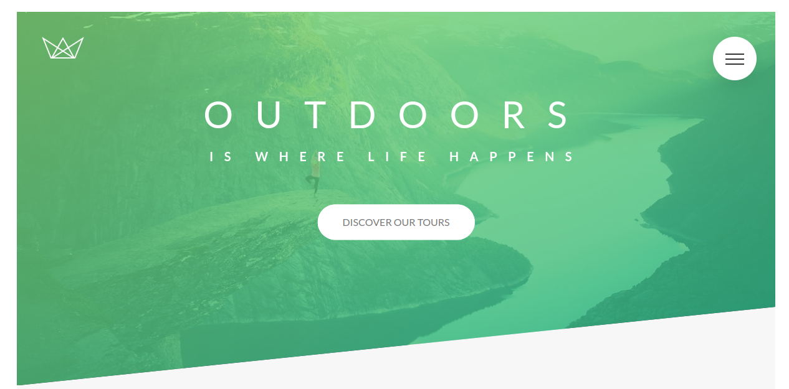
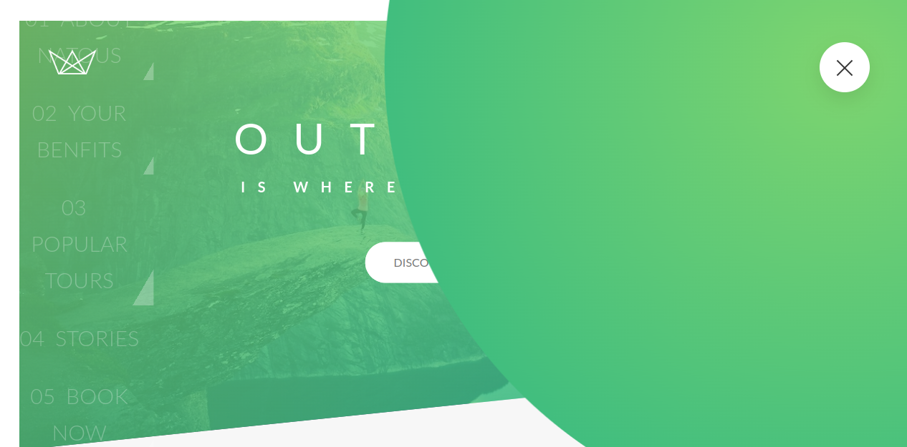
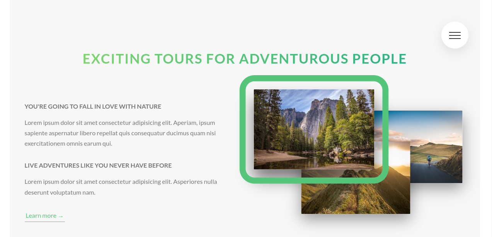
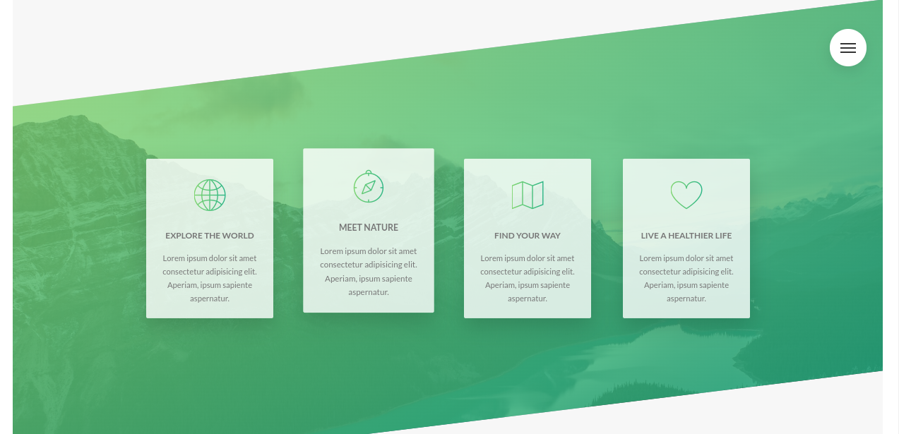
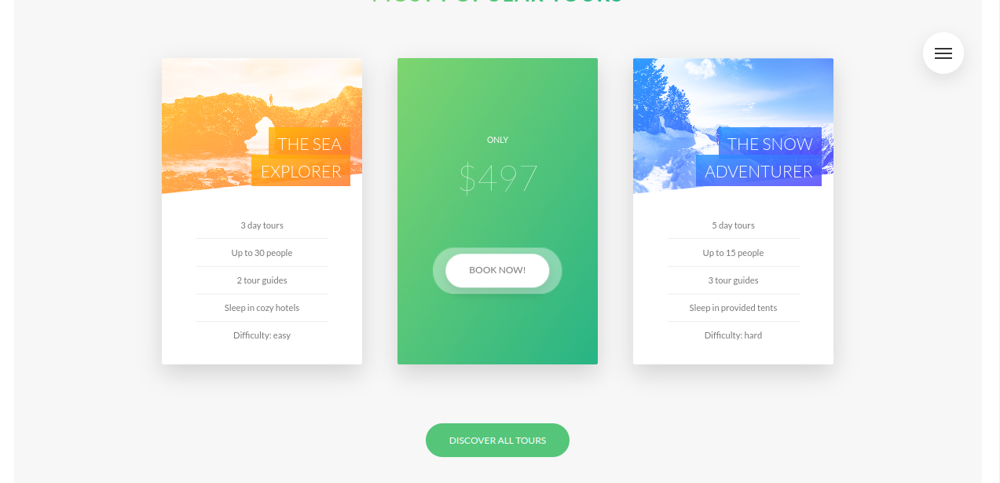
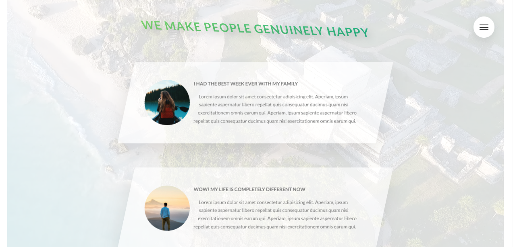
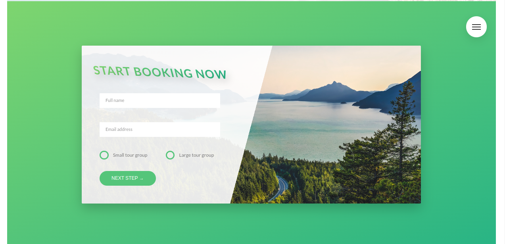
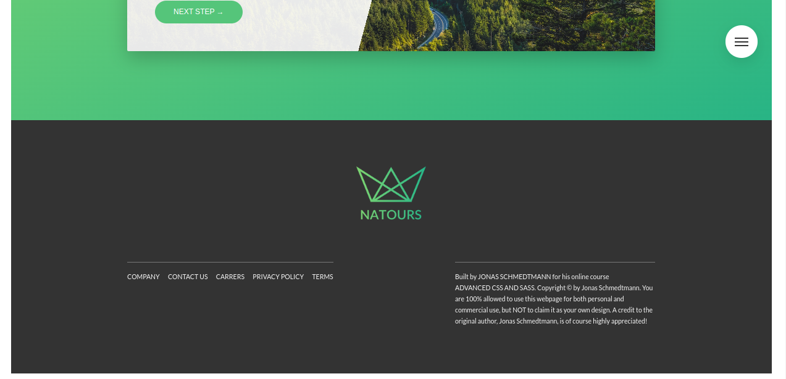

# OUTDOORS

[Live Demo](https://spectacular-swan-1fb30a.netlify.app/)

I worked on this project when i was learning SAAS and it can help you
a lot during you learing journey. if you are looking for a project
where you can learn HTML, SAAS, CSS3, Web desing, Advanced css
patterns, Responsive Layouts and much more then this is the best
project to look at

##### . Please checkout my fiverr account if you want to hire me

- [Find me on fiver ](https://www.fiverr.com/zainbinramzan/develop-web-applications-with-mern-stack-react-node-express-moongodbplugin-react/README.md)
- [Find me on linkedin](https://www.linkedin.com/in/abu-zain-html-css-javascipt-developer/)

##### Technologies used CSS3 + HTML5 + SAAS

